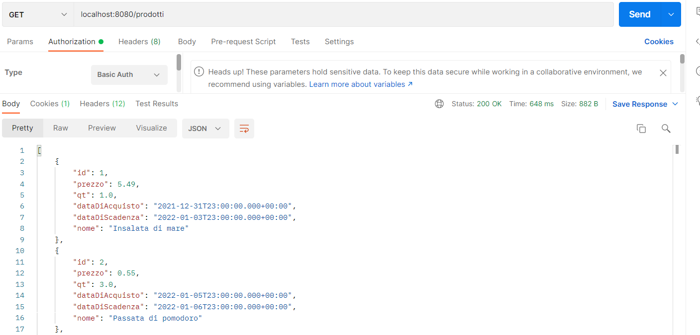
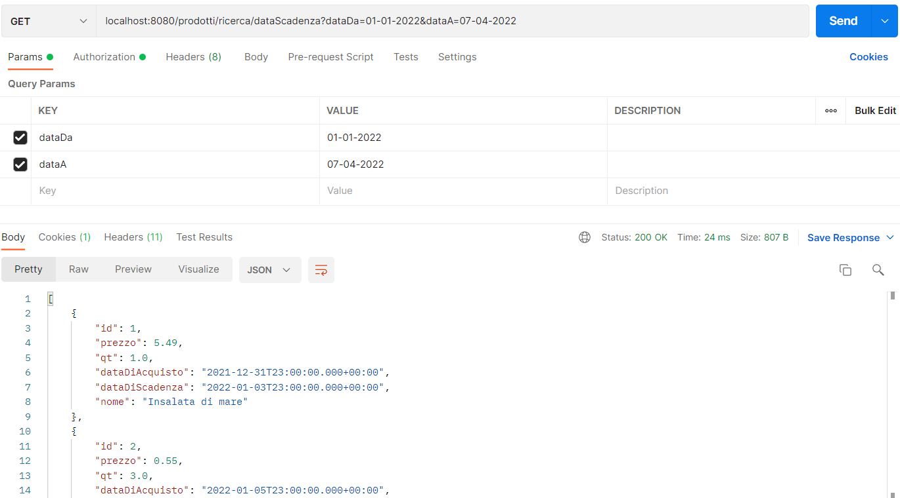
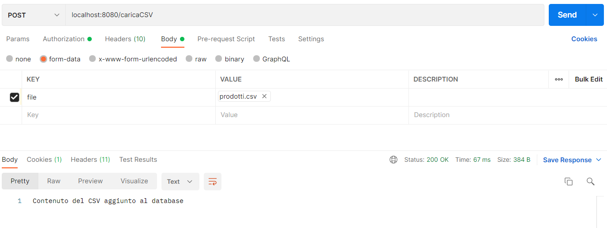
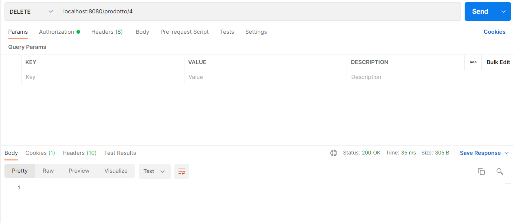
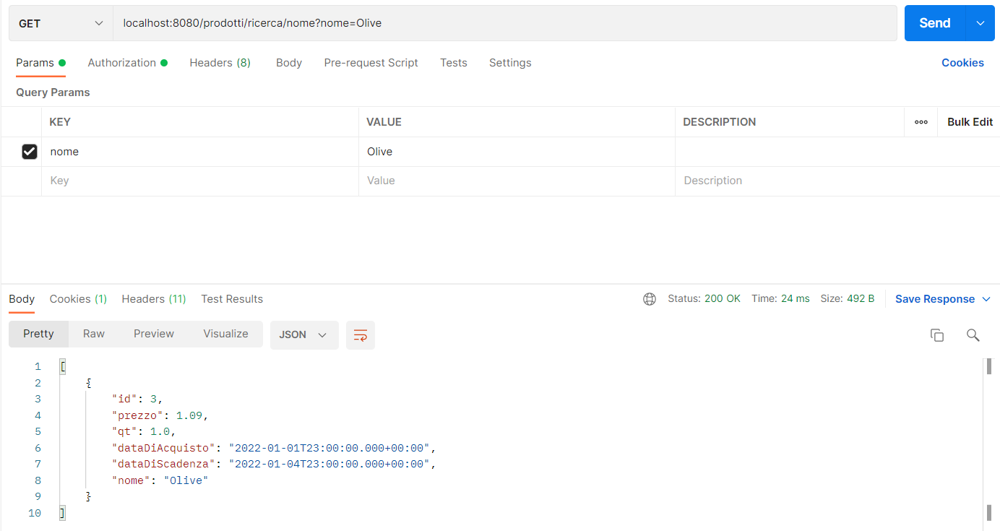

# SpringRestAppGestioneProdotti
Un' applicazione Spring Rest con database H2

##Guida

### Elenco delle Query

| Metodo     | URL                                       | Tipo di input | Descrizione                                                                           |
|------------|-------------------------------------------|---------------|---------------------------------------------------------------------------------------|
| **GET**    | `/prodotti`                               | nessuno       | ritorna la lista di tutti i prodotti nel database                                     |
 | **GET**    | `/prodotti/ricerca/dataAcquisto`          | 2 parametri   | ritorna una lista dei prodotti acquistati nel range di due date                       |
 | **GET**    | `/prodotti/ricerca/dataScadenza`          | 2 parametri   | ritorna una lista dei prodotti che scadono nel range di due date                      |
| **POST**   | `/caricaCSV`                              | file          | aggiunge al database il contenuto del file                                            |
| **POST**   | `/prodotto`                               | json          | aggiunge al database un nuovo prodotto                                                |
| **DELETE** | `/prodotto/{id}`                          | path variable | elimina il prodotto attraverso l'id                                                   |
| **GET**    | `/prodotti/{id}`                          | path variable | ritorna il prodotto con lo stesso id fornito                                          |
| **GET**    | `/prodotti/ricerca/qt/massimo`            | 1 parametro   | ritorna una lista dei prodotti con quantità minore di quella fornita                  |
| **GET**    | `/prodotti/ricerca/qt/massimoIncluso`     | 1 parametro   | ritorna una lista dei prodotti con quantità minore o uguale a quella fornita          |
| **GET**    | `/prodotti/ricerca/qt/minimo`             | 1 parametro   | ritorna una lista dei prodotti con quantità maggiore di quella fornita                |
| **GET**    | `/prodotti/ricerca/qt/minimoIncluso`      | 1 parametro   | ritorna una lista dei prodotti con quantità maggiore o uguale a quella fornita        |
| **GET**    | `/prodotti/ricerca/prezzo/massimo`        | 1 parametro   | ritorna una lista dei prodotti con prezzo minore di quello fornito                    |
| **GET**    | `/prodotti/ricerca/prezzo/massimoIncluso` | 1 parametro   | ritorna una lista dei prodotti con prezzo minore o uguale a quello fornito            |
| **GET**    | `/prodotti/ricerca/prezzo/minimo`         | 1 parametro   | ritorna una lista dei prodotti con prezzo maggiore di quello fornito                  |
| **GET**    | `/prodotti/ricerca/prezzo/minimoIncluso`  | 1 parametro   | ritorna una lista dei prodotti con prezzo maggiore o uguale a quello fornito          |
| **GET**    | `/prodotti/ricerca/nome`                  | 1 parametro   | ritorna una lista con tutti i prodotti che hanno il nome fornito                      |
 | **PUT**    | `/prodotti/{id}`                          | path variable | aggiorna un prodotto gia esistente se presente, altrimenti aggiunge un nuovo prodotto |

###Esempi di query con Postman

